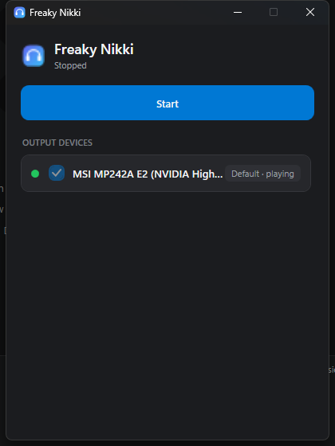

<div align="center">

# 🎧 Freaky Nikki

**Play your Windows audio on two or more headphones at the same time.**

Bluetooth + wired, mixed — no virtual audio driver, no admin rights, single `.exe`.

</div>

---

Freaky Nikki mirrors whatever your PC is playing (Spotify, YouTube, a game, a
movie) to **additional output devices** on top of your normal one. Great for
watching something together on two Bluetooth headphones, or splitting sound to a
speaker and headphones at once.

It uses Windows' built-in **WASAPI loopback** capture entirely in user-mode — so
there is nothing to install into the OS, no signed kernel driver, and no reboot.

<div align="center">
  
</div>

## How it works

```
System audio (Spotify, YouTube, a game…)
        │
        ▼
Default output device (Headphone 1)  ◄── plays normally, ZERO extra latency
        │
        ▼
WASAPI loopback capture (a copy of the same sound)
        │
        ├─► [resample] ─► [volume] ─► [delay] ─► Headphone 2
        └─► [resample] ─► [volume] ─► [delay] ─► Headphone N
```

Your **default device keeps playing untouched** (no added latency). Freaky Nikki
grabs a copy of the system sound and pushes it to the extra devices you pick.
Because Bluetooth devices each add their own latency, every extra device has a
**per-device delay slider** so you can line them up by ear.

## Features

- 🎚️ Mirror system audio to multiple output devices at once
- 🔊 Per-device **volume** and **delay** (0–500 ms) for lip-sync / echo fixing
- 🔌 Hot-plug aware — unplug/replug a device and it reconnects on its own
- 🎯 Smart default delay for Bluetooth devices, editable down to the millisecond
- 🎨 Minimal, modern UI that follows your Windows **light/dark** theme and accent
- 🪟 Lives in the tray; your device setup is remembered between runs
- 📦 One-click installer that **auto-updates** — no driver, no admin rights

## Download & install

Grab the latest build from the [Releases](../../releases) page:

- **`FreakyNikki-win-Setup.exe`** (recommended) — a small installer. No admin
  rights needed (installs to your user profile), and the app **auto-updates**
  itself from GitHub afterwards. When a new version is downloaded, an
  *"Update to vX.Y.Z"* button appears in the window — click it to restart into it.
- **`FreakyNikki-win-Portable.zip`** — unzip and run `FreakyNikki.exe`, no install.
  (Portable builds don't auto-update.)

Both are self-contained — you don't need the .NET runtime installed.

Then: run it → tick an extra output device → hit **Start**.

## Usage

1. Set your **default** playback device in Windows as usual (that one always plays).
2. In Freaky Nikki, tick any **extra** devices you want the sound mirrored to.
3. Press **Start**.
4. Hear an echo? Nudge that device's **delay** slider until it lines up.

## FAQ

**Why do I hear an echo / the devices are out of sync?**
Bluetooth adds latency (typically ~100–250 ms, and it differs per device). Use
the per-device **delay** slider to push the earlier device back until they match.

**Can I use two Bluetooth headphones on one adapter?**
Usually yes, but a single BT adapter streaming two A2DP connections can stutter on
weaker chipsets — that's outside the app's control.

**Does it add latency to my main headphones?**
No. Your default device plays normally; only the mirrored copies go through Freaky
Nikki.

## Build from source

Requires the [.NET 9 SDK](https://dotnet.microsoft.com/download/dotnet/9.0) on Windows.

```bash
git clone https://github.com/keremkocatus/freaky-nikki.git
cd freaky-nikki
dotnet run --project src/FreakyNikki
```

See [design/plan.md](design/plan.md) for the architecture and roadmap, and
[CONTRIBUTING.md](CONTRIBUTING.md) to help out.

## Limitations

- Windows only (relies on WASAPI / NAudio).
- Long sessions can slowly drift out of sync; a built-in drift correction keeps it
  in check, but you can always hit Stop/Start to resync.

## License

[MIT](LICENSE) © Kerem Kocatuş
